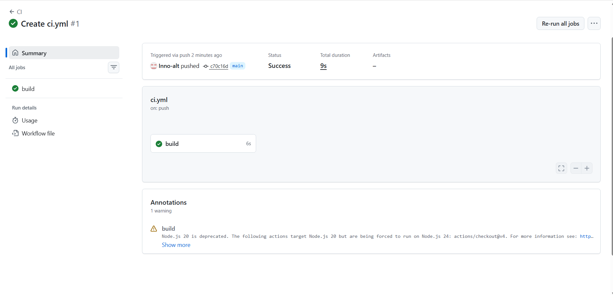

# 🏃 RaceDay Event Management System - Part 1

## 📖 System Description
RaceDay is a full-stack web-based event management system designed for the South African road running, walking, and cycling community.

## 👥 Roles

### Participant
- Browse and search for upcoming events
- Register for events
- View personal entry history
- Track performance results

### Organiser
- Create and manage events
- View participant entries
- Submit and update race results

## 📊 Database Design

The database consists of **6 entities**:

| Entity | Description |
|--------|-------------|
| User | Authentication and login details |
| Participant | Personal details for race participants |
| Organiser | Event organisers and their organisations |
| Event | Race/event details |
| Entry | Participant registrations for events |
| Result | Race results for participants |

## ✅ Part 1 Deliverables

| Section | Description | File |
|---------|-------------|------|
| A | Entity Relationship Diagram (ERD) | docs/PROG6212 PART 1 2026.pdf |
| B | API Endpoint Plan | docs/PROG6212 PART 1 2026.pdf |
| C | SQL Database Script | docs/raceday-schema.sql |
| CI/CD | GitHub Actions Workflow | .github/workflows/ci.yml |

## 🔧 CI/CD Status

✅ **Build Passing**

## 🎥 YouTube Walkthrough

Watch my walkthrough video here:

https://www.youtube.com/watch?v=https://youtu.be/wDM0rrPzHccYOUR_VIDEO_ID

## 👨‍💻 Author

**Name:** Innocentia Tlotleng

## 📅 Submission Date

September 2026

---
